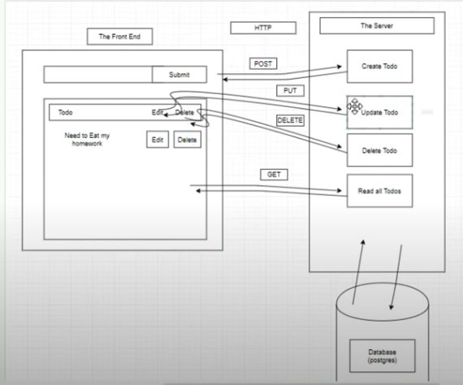
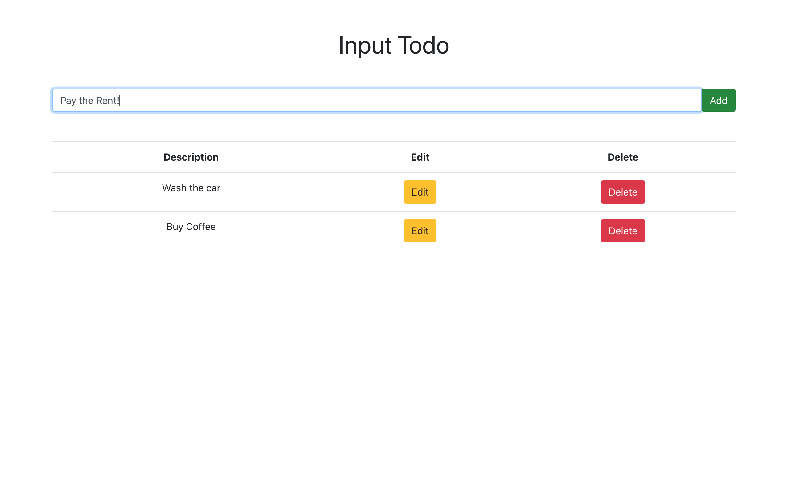
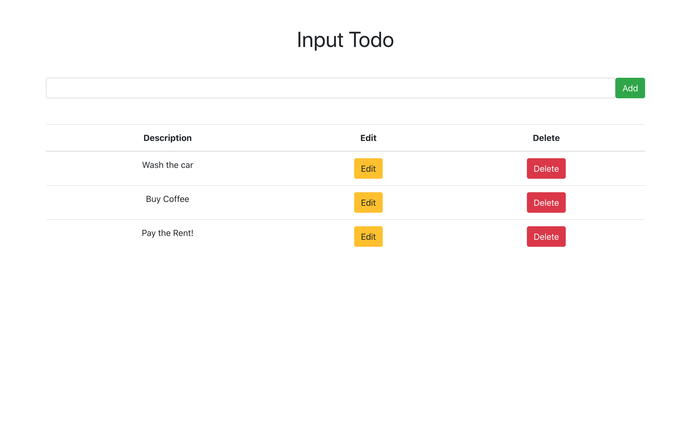
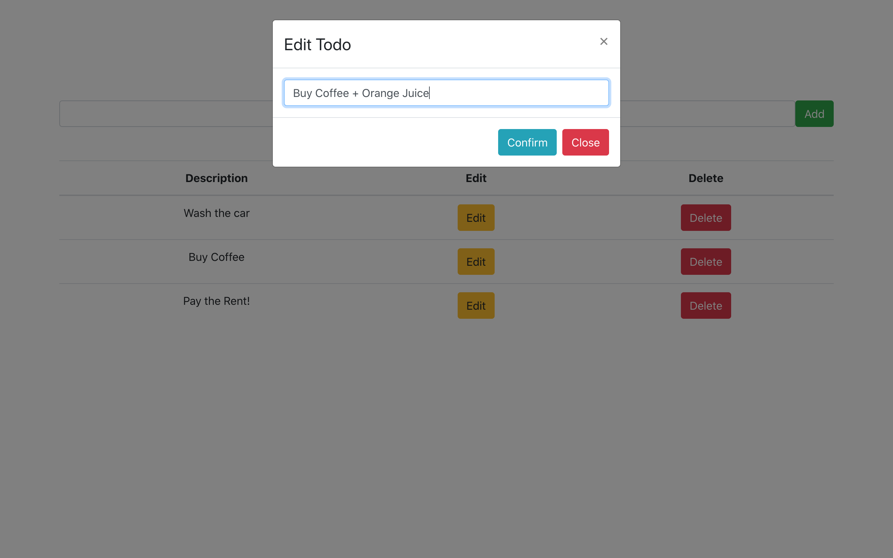

# Full Stack To-Do List

A Fill Stack PERN Application (PostgreSQL, Express, React, Node) that explores RESTful API's in a CRUD (Create, Read, Update, Delete) App that takes and stores to-do notes for a user.



---

## How to Run

Clone this repo, make sure you have Node.js installed, and if using a mac, have the homebrew manager installed.

Then in the command line, navigate to the [**Server**](server) directory, and type:

```
brew install postgresql
```

```
npm install
```

This will install the dependencies needed, and install the PostgreSQL database application. You will then need to run PostgreSQL on your local machine by typing int he command line:

```
psql
```

Then open up the [**database.sql**](database.sql) file and copy the `CREATE DATABASE` and `CREATE TABLE` commands into the psql command line. This will create your database and your table to store the descriptions of the to-do notes.

Update the [**db.js**](db.js) file with your `User` field from the Postgres (and any password if applicable). Then from the comman line, start up the server (in the server directory) by typing in:

```
npm start
```

Open up a new terminal, and then navigate to the [**Client**](client) directory. From here in the command line, also type in:

```
npm start
```

This will start up the Frontend, React interface. From here you will see the Todo User Interface. Todos can then be written, viewed, updated of deleted, this will be reflected in the Posgres database!

---

<table>
   <tr>
      <td>Adding a Todo</td>
       <td>Viewing Todo's</td>
       <td>Editing a Todo</td>
   </tr>
   <tr>
     <td valign="top"></td>
     <td valign="top"></td>
      <td valign="top"></td>
   </tr>
  </table>

---
